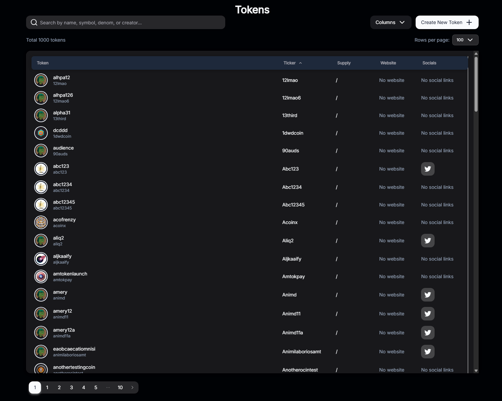
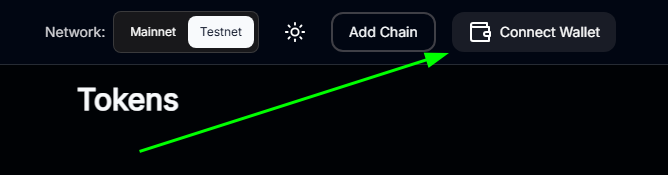
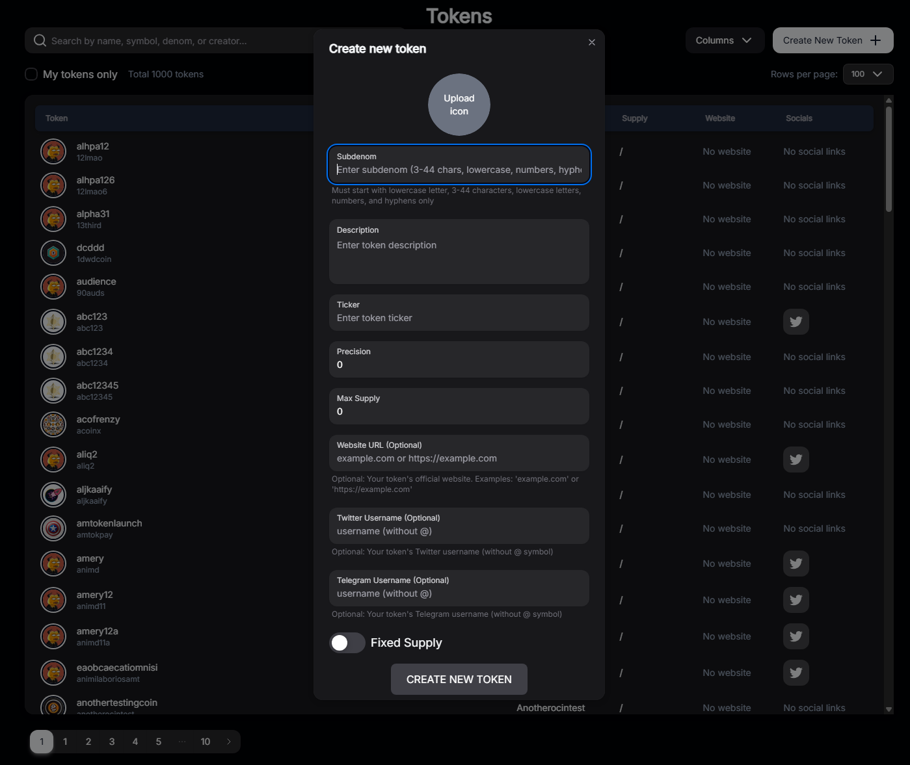
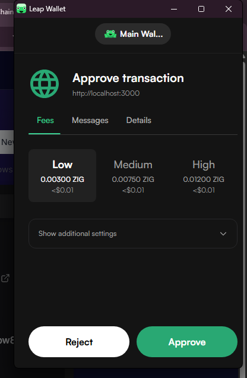
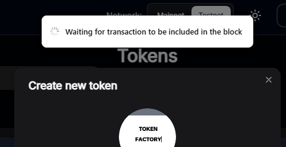
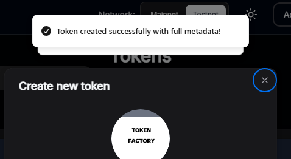

# Build a Token Factory in 15 Minutes

This quick-start guide will walk you through setting up and running the ZIGChain Token Factory application. By the end of this tutorial, you'll have a fully functional token factory application running locally that allows you to create and manage tokens on the ZIGChain network.

The Token Factory example lives in the [ZIGChain examples repository](https://github.com/ZIGChain/zigchain-examples-private) at [`examples/frontend/token-factory`](https://github.com/ZIGChain/zigchain-examples-private/tree/main/examples/frontend/token-factory).

## Prerequisites

Before you begin, ensure you have the following installed:

- **Node.js** (v18 or higher)
- **Git**
- **A compatible wallet extension** (Keplr or Leap)
- **A Pinata account** (free tier is sufficient)

**Estimated time:** 15 minutes

---

## Step 1: Clone and Install

First, clone the ZIGChain examples repository (or only the token factory example) and install the dependencies.

### 1.1 Clone the Repository

**Option A — Full clone (recommended for first-time setup):**

```bash
git clone https://github.com/ZIGChain/zigchain-examples-private.git
cd zigchain-examples-private/examples/frontend/token-factory
```

**Option B — Sparse checkout (download only the token factory):**

```bash
git clone --depth 1 --filter=blob:none --sparse https://github.com/ZIGChain/zigchain-examples-private.git zigchain-examples-private
cd zigchain-examples-private
git sparse-checkout set examples/frontend/token-factory
cd examples/frontend/token-factory
```

### 1.2 Install Dependencies

From the **token-factory** directory, install the project dependencies using your preferred package manager:

**npm:**

```bash
npm install
```

**yarn:**

```bash
yarn install
```

**pnpm:**

```bash
pnpm install
```

**bun:**

```bash
bun install
```

This will install all required dependencies including Next.js, React, ZIGChain SDK, and other necessary packages.

---

## Step 2: Set Up Pinata IPFS

[Pinata](https://www.pinata.cloud) is an IPFS (InterPlanetary File System) pinning service that allows you to upload and manage files on the decentralized web. The token factory uses Pinata to store token metadata (images, descriptions, etc.) on IPFS.

### 2.1 Create Account and Get API Credentials

To set up Pinata for the Token Factory, you'll need:

1. **A Pinata account** - Sign up at Pinata (free tier is sufficient)
2. **A JWT Token** - Used to authenticate API requests for uploading files to IPFS
3. **A Gateway URL** - Used to access your IPFS files

For detailed step-by-step instructions, see the [Pinata Quickstart](https://docs.pinata.cloud/quickstart).

**Quick Reference:**

- **Get `PINATA_JWT`**: Sign up at Pinata, go to **API Keys**, create a new API key (JWT), and copy the JWT value (you won't be able to see it again).
- **Get `NEXT_PUBLIC_GATEWAY_URL`**: In the Pinata dashboard, open the **Gateways** tab and copy your gateway domain (e.g. `your-subdomain.mypinata.cloud`). Use `https://` + that domain (e.g. `https://your-subdomain.mypinata.cloud`).

### 2.2 Understanding Pinata and IPFS

**What is IPFS?**
IPFS (InterPlanetary File System) is a distributed file storage system that stores files across multiple nodes. Files are identified by their content hash (CID), ensuring immutability and decentralization.

**Why use Pinata?**

- **Pinning Service**: Pinata ensures your files remain accessible on IPFS
- **Easy Upload**: Provides a simple API for uploading files
- **Gateway Access**: Offers fast gateway URLs to access your IPFS files
- **Free Tier**: Includes generous free storage for development

**How it works in the Token Factory:**

- Token metadata (name, description, image) is uploaded to IPFS via Pinata
- The IPFS hash (CID) is stored on-chain with your token
- Users can retrieve token metadata using the IPFS gateway URL

---

## Step 3: Configure Environment Variables

The repository includes an `.env.example` file with pre-configured mainnet and testnet endpoints. Create a `.env.local` file in the **project root** (the `token-factory` app directory):

1. Copy the example file:

   ```bash
   cp .env.example .env.local
   ```

2. Or manually create `.env.local` with the following environment variables:

```env
PINATA_JWT=
NEXT_PUBLIC_GATEWAY_URL=

# Site branding (used in page title, nav bar, and meta description)
NEXT_PUBLIC_SITE_TITLE=My Token Factory
NEXT_PUBLIC_SITE_DESCRIPTION=Token Factory for My Project

# Network Configuration for Mainnet
NEXT_PUBLIC_MAINNET_API_URL=https://public-zigchain-lcd.numia.xyz
NEXT_PUBLIC_MAINNET_RPC_URL=https://public-zigchain-rpc.numia.xyz
NEXT_PUBLIC_MAINNET_CHAIN_ID=zigchain-1

# Network Configuration for Testnet
NEXT_PUBLIC_TESTNET_API_URL=https://public-zigchain-testnet-lcd.numia.xyz
NEXT_PUBLIC_TESTNET_RPC_URL=https://public-zigchain-testnet-rpc.numia.xyz
NEXT_PUBLIC_TESTNET_CHAIN_ID=zig-test-2

# Default Network (mainnet or testnet)
NEXT_PUBLIC_DEFAULT_NETWORK=testnet

# Logging
ENABLE_LOGGING=false
```

### Environment Variables Explained

- **`PINATA_JWT`**: Your Pinata JWT token from [Step 2.1](#21-create-account-and-get-api-credentials). See the [Pinata Quickstart](https://docs.pinata.cloud/quickstart) for how to create an API key and get your JWT.

- **`NEXT_PUBLIC_GATEWAY_URL`**: The public gateway URL for accessing IPFS files. Get your gateway domain from the Pinata dashboard (Gateways tab); see the [Pinata Quickstart](https://docs.pinata.cloud/quickstart) for details.

- **`NEXT_PUBLIC_SITE_TITLE`**: Site name used in the browser tab, nav bar, and logo alt text.

- **`NEXT_PUBLIC_SITE_DESCRIPTION`**: Meta description for the app (e.g. for search results and social previews).

- **Mainnet**: `NEXT_PUBLIC_MAINNET_API_URL`, `NEXT_PUBLIC_MAINNET_RPC_URL`, `NEXT_PUBLIC_MAINNET_CHAIN_ID` — LCD API URL, RPC URL, and chain ID for ZIGChain mainnet.

- **Testnet**: `NEXT_PUBLIC_TESTNET_API_URL`, `NEXT_PUBLIC_TESTNET_RPC_URL`, `NEXT_PUBLIC_TESTNET_CHAIN_ID` — LCD API URL, RPC URL, and chain ID for ZIGChain testnet.

- **`NEXT_PUBLIC_DEFAULT_NETWORK`**: Default network to use — set to `mainnet` or `testnet`. You can also switch between mainnet and testnet from the app UI.

- **`ENABLE_LOGGING`**: Set to `true` to enable logging.

**Note:** The example file already includes mainnet and testnet endpoints. You only need to fill in your Pinata credentials (`PINATA_JWT` and `NEXT_PUBLIC_GATEWAY_URL`) and optionally customize `NEXT_PUBLIC_SITE_TITLE` and `NEXT_PUBLIC_SITE_DESCRIPTION`. Never commit your `.env.local` file to version control.

### Logo and Favicon

- **Logo**: Add a `logo.png` file to the `public/` folder (or replace the existing one). The nav bar uses this image; the logo text and image alt come from `NEXT_PUBLIC_SITE_TITLE`.
- **Favicon**: Place your favicon in `public/` (e.g. `favicon.ico`) or in `app/` (e.g. `app/favicon.ico`) so it appears in the browser tab.

---

## Step 4: Run the Application

Start the development server:

**npm:**

```bash
npm run dev
```

**yarn:**

```bash
yarn dev
```

**pnpm:**

```bash
pnpm dev
```

**bun:**

```bash
bun dev
```

Open [http://localhost:3000](http://localhost:3000) in your browser. You should see the Token Factory application main page, which displays a list of all tokens created on the ZIGChain network.



The app lets you **switch between mainnet and testnet** from the UI, and includes a **dark mode** switch so you can choose your preferred theme.

---

## Using the Application

### Connect Your Wallet

1. Click the **"Connect Wallet"** button on the main page
2. Select your wallet (Keplr or Leap)
3. Approve the connection request in your wallet extension
4. If this is your first time, you may need to add the ZIGChain network to your wallet



**Note**: If you haven't added ZIGChain to your wallet yet, refer to the [Set Up a ZIGChain Wallet](../users/wallet-setup/zigchain-wallet) tutorial.

### Create a New Token

1. Click on the **"Token Creation"** tab
2. Fill in the token details:
   - **Name**: The full name of your token (e.g., "My Awesome Token")
   - **Ticker**: A short symbol for your token (e.g., "MAT")
   - **Precision**: Decimal places (typically 6 or 18)
   - **Maximum Supply**: The total supply cap for your token
   - **Description**: Optional description of your token
   - **Image**: Upload a token image (will be stored on IPFS via Pinata)
   - **Social Links**: Optional links to website, Twitter, etc.

3. **Upload Metadata to Pinata**:
   - When you fill in the token details and upload an image, the application automatically uploads the metadata to IPFS via Pinata
   - The IPFS hash (CID) will be generated and stored with your token
   - You can verify the upload in your Pinata dashboard under "Files"



4. Click **"Create New Token"** (or **"Create Token"**) to submit the transaction
5. **Approve the action in your wallet extension** — Your wallet (Keplr or Leap) will open and ask you to confirm the transaction. Review the details and approve to broadcast the transaction to the network.



6. Wait for the transaction to be confirmed on-chain



7. Once confirmed, your new token will appear in the tokens list on the main page!



---

## Next Steps

Now that you have the Token Factory running locally, you can:

- **Customize Tokens**: Experiment with different token parameters and metadata
- **Deploy to Production**: For deployment instructions, see the [deployment documentation](https://vercel.com/docs)
- **Learn More**: Read the [ZIGChain Module - Token Factory](../builders/factory) to understand the underlying blockchain functionality
- **Explore More Examples**: Browse the [ZIGChain examples repository](https://github.com/ZIGChain/zigchain-examples-private) and the [Token Factory example](https://github.com/ZIGChain/zigchain-examples-private/tree/main/examples/frontend/token-factory) for the full README and project structure

---

Congratulations! You've successfully set up and are running the ZIGChain Token Factory application. Happy token creating! 🚀
